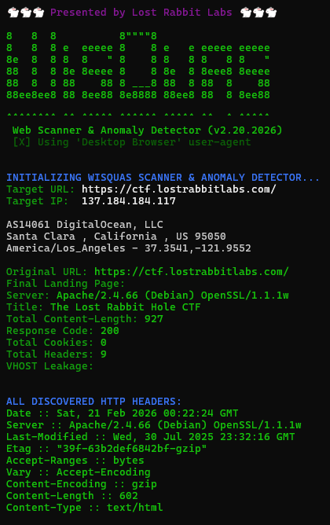
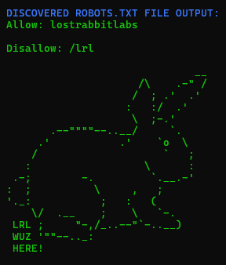

<table style="border: none">
    <tr style="text-align: left; border: none">
        <th style="height: auto; width: 125px; padding-top: 55px; border: none">
            <a href="https://www.lostrabbitlabs.com"></a>
        </th>
        <th style="border: none">
            <h1> --- WisQuas-CLI --- </h1>
            <p><strong>WisQuas-CLI</strong> strips illusion from creatures hidden by the cloak of invisibility, instantly revealing their position. Nightshade cut many times to form a paper-like sheet, then carved into lace is secured by spider silk. It is glazed, dried in the sun, then crystallized into a shiny powder that must be tossed in the sky over the field of battle as the spell is cast.</p>
            <p>Have any questions 🐇? Reach out to us at [lostrabbitlabs.com](https://lostrabbitlabs.com)</p>
        </th>
    </tr>
</table>

<br>

---

## Contributors

<strong>Jimi Allee</strong> & <strong>Will Lenzini</strong>

---

## What is WisQuas

<p>A simple 'URL Revealer' (fast and lightweight scanner, enumerator, fingerprinter, fuzzer, assessor, and collector). Assists with finding vulnerabilities, anomalies, unique servers, available files/dirs, methods, and containers.</p>

---

## How does it work?
<p>Provide a URL to WisQuas and it will perform the following functions...</p>

* Resolve hostname to IP address
* Perform ASN lookup on IP address to provide ownership info and possible geolocation
* Inventories all received headers and cookies
* Baseline original URL request to compare to all other requests
* Tactical fuzzing and enumeration to generate unique errors and reveal layered web services
* Inspect robots.txt file if available
* Inspect possible common SBOM packages
* Automatically harvest server-status URLs
* Enumerate through possible HTTP Verbs
* Perform Host Header Manipulation to detect additional accessible containers
* Automatically analyze response differences in HTTP protocol specifications
* Gather URLs and API endpoints from response bodies
* Crawl JavaScript resources and harvest URLs and API endpoints
* Automatically attempt to de-minify JavaScript resources with available map files
* Generate MD5 checksum values for detected images

---

## Example Commands and Usage

WisQuas on URL using 'Desktop Browser' profile:

```sh
python3 wisquas-cli.py -1 "http://example.com/"
```

WisQuas on URL using 'Mobile Browser' profile:

```sh
python3 wisquas-cli.py -2 "http://example.com/"
```

WisQuas on URL using custom 'host header' on requests:

```sh
python3 wisquas-cli.py -1 "http://example.com/" customhostname
```

Create a PDF report from output (requires additional software):

```sh
python3 wisquas-cli.py -1 "http://example.com/" > example.com.txt; cat example.com.txt | aha -b | wkhtmltopdf - example.com.pdf
```





---

## Install Method A: Python3

This script requires Python 3.10 or later. The following python dependencies are required to run <strong>WisQuas-CLI</strong>:

```sh
pip install aiohttp bs4 requests tldextract colorama lxml sourcemap
```

## Install Method B: Python venv

Ensure that python3.10+ is installed:

```sh
python3 --version
```

Then, install python3-venv on your machine:

```sh
sudo apt-get install -y python3-venv
```

Create and activate a virtual environment
```sh
python3 -m venv .venv
source .venv/bin/activate
```

Then install the required python3 script dependencies:

```sh
pip install aiohttp==3.13.3 bs4==0.0.2 requests==2.32.5 tldextract==5.3.1 colorama==0.4.6 lxml==6.0.2 sourcemap==0.2.1
```

---

## Install Method C: Pyenv

This script requires Python 3.10 or later. We recommend running it inside a Python virtual environment

First, install pyenv's dependencies on your machine:

```sh
sudo apt update && sudo apt install -y make build-essential libssl-dev zlib1g-dev libbz2-dev libreadline-dev libsqlite3-dev wget curl llvm libncursesw5-dev xz-utils tk-dev libxml2-dev libxmlsec1-dev libffi-dev liblzma-dev
```

Then, install pyenv:

```sh
curl https://pyenv.run | bash
```

You will need to modify your .bashrc or .zshrc file with the following after installation of pyenv:

```sh
export PYENV_ROOT="$HOME/.pyenv"
[[ -d $PYENV_ROOT/bin ]] && export PATH="$PYENV_ROOT/bin:$PATH"
eval "$(pyenv init - bash)"
eval "$(pyenv virtualenv-init -)"
```

Then, install python 3.12.3 using pyenv:

```sh
pyenv install 3.12.3 && pyenv global 3.12.3
```

Alternatively, if you would like to set the python3 version only for the wisquas-cli directory:

```sh
pyenv install 3.12.3 && pyenv local 3.12.3
```

Then install the required python3 script dependencies:

```sh
pip install aiohttp==3.13.3 bs4==0.0.2 requests==2.32.5 tldextract==5.3.1 colorama==0.4.6 lxml==6.0.2 sourcemap==0.2.1
```

---

## License

MIT License